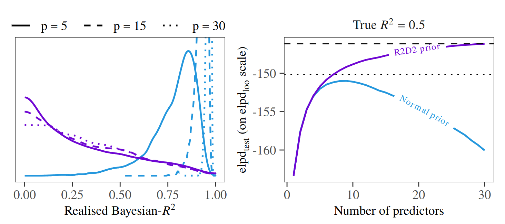
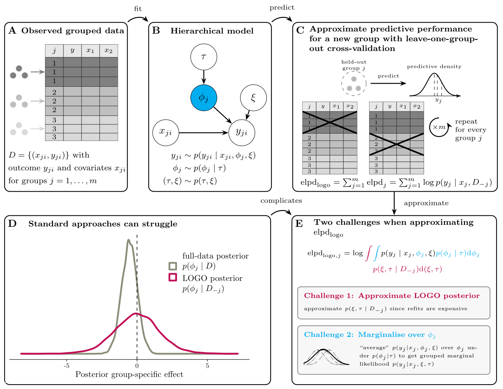
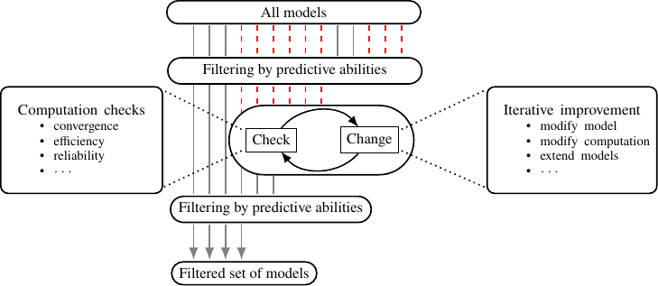

## To select or not to select: predictively consistent priors instead of model selection

<a href="https://arxiv.org/abs/2606.22850" target="_blank">arXiv Preprint</a> | <a href="https://github.com/annariha/to-select-or-not" target="_blank">Code</a> | <a href="https://statmodeling.stat.columbia.edu/2026/06/24/to-select-or-not-to-select/" target="_blank">Blogpost</a>  | <a href="https://youtu.be/9wqbP9aLdPg?si=8lnfnoA5h9fFlisu" target="_blank">Talk at StanCon 2026</a> 

Bayesian modelling workflows often consider multiple candidate models of varying complexity. Model selection is commonly used to navigate potential trade-offs between model complexity and generalisability to new data. We study when model selection is unnecessary or can even be harmful for predictive performance in finite data regimes and find that the need for selecting simpler models can depend on prior choice. We formalise predictively consistent priors, which keep prior predictive implications stable as model complexity increases. Across examples and numerical experiments, including adding covariates in linear and logistic regression, forward variable selection, and nonlinear modelling, flexible models with predictively consistent priors typically match or outperform selected simpler models in out-of-sample predictive performance. When selection helps, it can indicate poor joint prior implications, such as excessive prior mass on implausible predictive values. Based on our findings, we propose replacing the notion of sparsity or parsimony at the level of model components with specifying priors that remain sensible in predictive space as models become more complex.

----

## Approximating Bayesian leave-one-group-out cross-validation

<a href="https://arxiv.org/abs/2609.05713" target="_blank">arXiv Preprint</a> 

When data are grouped, hierarchical or multilevel models are commonly used to account for group-level variation with group-specific parameters. Leave-one-group-out cross-validation (LOGO-CV) is a suitable tool for evaluating predictive performance for new groups, providing an estimator of the expected log predictive density (elpd). Brute-force LOGO-CV requires one model refit per held-out group, often using computationally expensive inference algorithms such as MCMC. This is costly, particularly for large numbers of groups or complex model structures. Commonly used importance sampling approximations, intended to reduce this cost, tend to fail because the group-specific parameters of the held-out group must be integrated out. We identify two key challenges in LOGO-CV elpd estimation: approximating the LOGO posterior and computing the grouped marginal likelihood. We compare 11 strategies, including 5 newly proposed, to address them. Among others, we combine Pareto-smoothed importance sampling or adaptive importance sampling with integration techniques such as Laplace approximation, adaptive Gauss-Hermite quadrature, and bridge sampling. We evaluate these strategies in both simulation experiments and real-world case studies, which show that marginalising over the group-specific parameters substantially improves the reliability of the importance sampling approaches. 

----

## Supporting Bayesian workflows with iterative filtering for multiverse analysis

<a href="https://arxiv.org/abs/2404.01688" target="_blank">arXiv Preprint</a> | <a href="https://github.com/annariha/multi-workflows" target="_blank">Code</a> | <a href="https://statmodeling.stat.columbia.edu/2024/04/03/50429/" target="_blank">Blogpost</a> | <a href="https://www.youtube.com/watch?v=H9rzpd-z7mQ&list=PLCrWEzJgSUqzNzh6mjWsWUu-lSK59VXP6&index=23" target="_blank">Talk at StanCon 2024</a> 

When building statistical models for Bayesian data analysis tasks, required and optional iterative adjustments and different modelling choices can give rise to numerous candidate models. Checks and evaluations throughout the modelling process can motivate changes to an existing model or the consideration of alternatives. Failing to consider alternative models can lead to overconfidence in the predictive or inferential ability of a chosen model. The search for suitable models requires modellers to work with multiple models without jeopardising the validity of their results. Multiverse analysis enables the transparent creation of several models based on different modelling choices, but the number of models can become overwhelming in practice, and we require tools to reduce sets of models towards fewer models of higher quality across different modelling contexts. Motivated by these challenges, this work proposes iterative filtering for multiverse analysis to support efficient and consistent assessment of multiple models. Given that causal constraints have been considered, we show how multiverse analysis can be combined with recommendations from established Bayesian modelling workflows to identify promising candidate models by assessing predictive abilities and, if needed, tending to computational issues. We illustrate our suggested approach in different realistic modelling scenarios using real data examples.

----